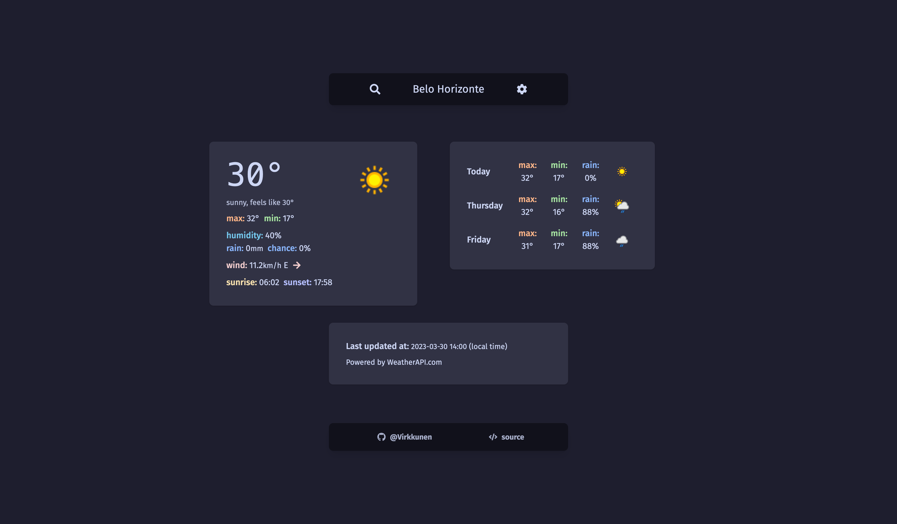
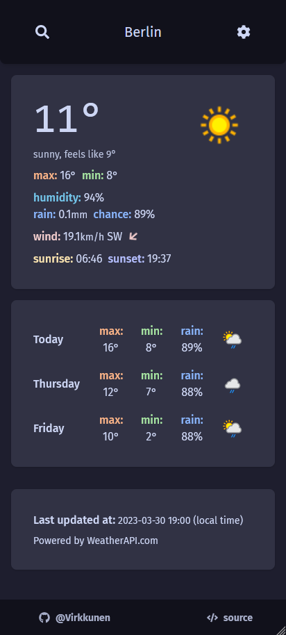

# Weather

A simple responsive weather app made with React and TypeScript, generated using Vite.
All weather data provided by [Weather API](https://www.weatherapi.com).

 
<br>


## Features

- Current weather
- 3 day forecast
- Automatically sets your location (if consented)
- Search for cities around the world
- Metric and Imperial units
- Able to provide your own [Weather API key](https://www.weatherapi.com)
- Responsive layout


## Screenshots





## Demo

[Weather](https://vrkknn.net/weather)


## Run Locally

- Clone the project

```bash
  git clone https://github.com/Virkkunen/weather.git
```

- Go to the project directory

```bash
  cd weather
```

- Install dependencies

```bash
  npm i
```

- Create the `.env` file on the root of the project and add your [Weather API key](https://www.weatherapi.com)
```bash
VITE_WEATHER_API_KEY=YOUR_API_KEY_HERE
```

- Start the server

```bash
  npm run dev
```

- The server will be running locally on `localhost:5173/weather/`


## Authors

- [@Virkkunen](https://www.github.com/Virkkunen)


## Tech Stack

React, TypeScript, Vite, TailwindCSS, Headless UI, RESTful API